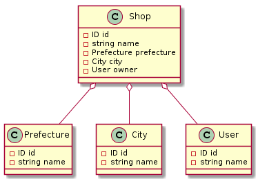

# graphql-php-study
graphqlおよびgraphql-phpの学習用リポジトリ

## 注意

実装にあたり https://github.com/kazuhei/graphql-sample を参考にさせていただきました。

## 使い方

```
git clone https://github.com/SuzukiCecil/graphql-php-study.git
cd graphql-php-study/
composer install
php -S localhost:8080 ./index.php
```

## クエリ例

```
query {
  shops {
    id
    name
    prefecture {
      id
      name
    }
    city {
      id
      name
    }
  }
}

```

## レスポンス例

```
{
  "data": {
    "shops": [
      {
        "id": "1",
        "name": "エキテン整骨院",
        "prefecture": {
          "id": 1,
          "name": "北海道"
        },
        "city": {
          "id": 1001,
          "name": "札幌市"
        }
      },
      {
        "id": "2",
        "name": "エキテン青果店",
        "prefecture": {
          "id": 13,
          "name": "東京都"
        },
        "city": {
          "id": 13001,
          "name": "新宿区"
        }
      },
      {
        "id": "3",
        "name": "エキテンカフェ",
        "prefecture": {
          "id": 13,
          "name": "東京都"
        },
        "city": {
          "id": 13001,
          "name": "新宿区"
        }
      }
    ]
  }
}
```

## UML


Userは追って対応予定
